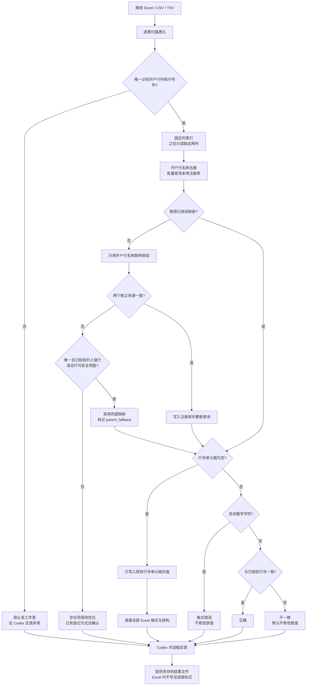

# CNAPS 自动补全与核对流程

```mermaid
flowchart TD
    A[接收 Excel / CSV / TSV] --> B[逐表扫描表头]
    B --> C{唯一识别开户行列和行号列?}
    C -- 否 --> C1[停止该工作表<br/>在 Codex 反馈异常]
    C -- 是 --> D[固定列索引<br/>之后只读取这两列]
    D --> E[开户行名称去重<br/>批量查询本地注册库]
    E --> F{取得已核验映射?}
    F -- 否 --> G[只用开户行名称联网核验]
    G --> H{两个独立来源一致?}
    H -- 否 --> H2{唯一且已核验的上级行<br/>或总行可安全兜底?}
    H2 -- 否 --> H1[空白项保持空白<br/>已有值记为无法确认]
    H2 -- 是 --> H3[采用兜底映射<br/>标记 parent_fallback]
    H -- 是 --> I[写入注册库并重新查询]
    F -- 是 --> J{行号单元格为空?}
    I --> J
    H3 --> J
    J -- 是 --> K[只写入现有行号单元格的值]
    J -- 否 --> L{含非数字字符?}
    L -- 是 --> L1[格式错误<br/>不修改原值]
    L -- 否 --> M{与已核验行号一致?}
    M -- 是 --> M1[正确]
    M -- 否 --> M2[不一致<br/>默认不修改原值]
    K --> N[保留全部 Excel 格式与结构]
    C1 --> O[Codex 对话框反馈]
    H1 --> O
    L1 --> O
    M1 --> O
    M2 --> O
    N --> O
    O --> P[提供另存的结果文件<br/>Excel 内不写总结或标记]
```

硬性边界：识别后只读取开户行和行号两列；工作簿中只允许修改现有行号单元格的值；所有写入明细、异常、兜底和核对结果只在 Codex 对话框反馈。
